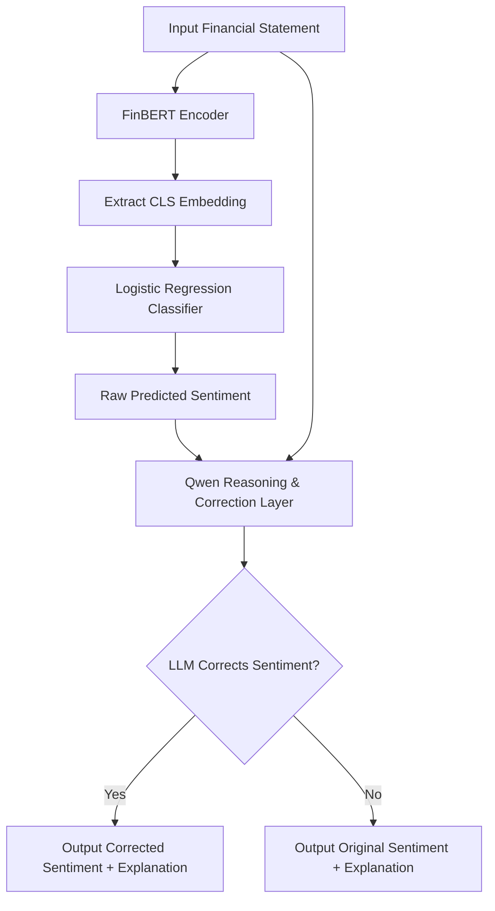

# Financial Sentiment Analysis & Reasoning Pipeline

A hybrid, state-of-the-art framework for financial sentiment classification and explanation generation. This system combines **FinBERT embeddings**, a **Logistic Regression classifier**, and a **large language model (LLM - Qwen/Qwen3-0.6B)** to classify financial statements, correct keyword-based classification biases, and generate explanations.

---

## 🏗️ Architecture & Workflow

The system uses a hybrid classification-reasoning architecture. While FinBERT provides the domain-specific representation and the Logistic Regression classifies the raw input, the LLM acts as a reasoning corrector and explainer to bypass standard keyword biases (e.g. classifying positive phrases like *"production costs declined"* as negative because of the word *"declined"*).

FlowChart-Financial Sentiments Analysis\Screenshot\FlowChart.png


### ⚙️ Offline Phase: Dataset Preparation & Classifier Training
This phase is executed once to clean the raw data, generate embedding features, and train the classifier model.

1. **Preprocessing & Splitting (`data_loader.py` & `preprocess.py`)**
   * The raw Financial Phrasebank dataset ([Sentences_AllAgree.txt](./data/raw/Sentences_AllAgree.txt)) is loaded and parsed.
   * A stratified split (80% training, 20% testing) is performed to ensure balanced representation of `positive`, `negative`, and `neutral` classes across both sets.
2. **FinBERT Feature Extraction (`generate_embeddings.py`)**
   * The text segments are passed to the tokenizer of the domain-specific **FinBERT** (`ProsusAI/finbert`) model to generate token IDs and attention masks.
   * These inputs are fed through the **FinBERT Encoder (BERT Layers)**.
   * The 768-dimensional embedding of the `[CLS]` token (index 0) is extracted from the model's `last_hidden_state`, representing the high-dimensional context of each statement.
   * These extracted feature matrices are saved on disk as numpy array files (`train_embeddings.npy` and `test_embeddings.npy`).
3. **Classifier Training (`train_classifier.py`)**
   * A **scikit-learn Logistic Regression** classifier is trained on the training embeddings (`train_embeddings.npy`) against the categorical string targets (`train_labels.npy`).
   * The fitted classifier weights are exported and serialized into [models/sentiment_classifier.pkl](./models/sentiment_classifier.pkl).
4. **Validation & Evaluation (`evaluate.py`)**
   * The test split is evaluated through the trained classifier. Performance metrics (Precision, Recall, and F1-Scores) are computed and printed to verify accuracy.

### ⚡ Online Phase: Real-Time Inference & Reasoning Correction
This pipeline is triggered dynamically during inference (e.g. running [app.py](./app.py) or [bulk_predict.py](./src/bulk_predict.py)).

1. **Statement Embedding Extraction (`predict.py`)**
   * The incoming statement string is tokenized and embedded using the base **FinBERT encoder** to retrieve its 768-dimensional `[CLS]` token feature vector.
2. **Sentiment Prediction (`predict.py`)**
   * The serialized **Logistic Regression classifier** (`sentiment_classifier.pkl`) receives the embedding vector.
   * It predicts the raw target sentiment label and computes class probabilities (using `predict_proba`). The maximum probability is converted to a percentage to serve as the prediction confidence score.
3. **LLM Semantic Verification & Correction (`fingpt_explain.py`)**
   * The raw statement along with the classifier's predicted sentiment are passed to **Qwen (`Qwen/Qwen3-0.6B`)**.
   * Qwen evaluates the statement using few-shot prompt context to verify if the prediction is semantically logical. 
   * If the classifier predicts an incorrect label due to localized keyword biases (e.g. predicting positive cost reduction *"production costs declined"* as negative because of the word *"declined"*), **Qwen overrides and corrects the sentiment label** to the true classification.
4. **Reasoning Explanation Generation (`fingpt_explain.py`)**
   * Qwen generates a concise 1-2 sentence explanation stating the financial insight and rationale behind the true sentiment.
5. **Output Aggregation (`pipeline.py`)**
   * The final outputs—corrected sentiment, classification confidence score, and LLM-generated explanation—are aggregated and returned to the application console or batch export file.

---

## 📂 Project Directory Structure & Significance

The following is a curated guide to the active files in this repository:

### Root Application Files
* **[app.py](./app.py)**: The main interactive terminal application. It accepts user input, runs the pipeline, and prints the final sentiment, confidence, and LLM-generated explanation.
* **[streamlit_app.py](./streamlit_app.py)**: The interactive Web User Interface built with Streamlit. It displays sentiment indicators, confidence meters, reasoning explanations, and example headlines in a clean browser dashboard.
* **[requirements.txt](./requirements.txt)**: Specifies python dependencies including `torch`, `transformers`, `scikit-learn`, `joblib`, `accelerate`, and `streamlit`.

### Source Code (`src/`)
* **[src/data_loader.py](./src/data_loader.py)**: Handles loading and cleaning of the Financial Phrasebank dataset (`Sentences_AllAgree.txt`).
* **[src/preprocess.py](./src/preprocess.py)**: Performs a stratified split (80/20) of the cleaned data and exports them into training and test CSV splits.
* **[src/generate_embeddings.py](./src/generate_embeddings.py)**: Uses the FinBERT base model to extract 768-dimensional `[CLS]` token embeddings for both the train and test splits, saving them as serialized numpy `.npy` arrays.
* **[src/train_classifier.py](./src/train_classifier.py)**: Fits a Logistic Regression classifier on top of the training embeddings and dumps the model to disk.
* **[src/evaluate.py](./src/evaluate.py)**: Loads the test split embeddings, evaluates the classifier, and prints classification reports.
* **[src/predict.py](./src/predict.py)**: Core sentiment classification module. Tokenizes and embeds statement text via FinBERT, runs predictions via the trained Logistic Regression model, and returns the sentiment label and confidence score.
* **[src/fingpt_explain.py](./src/fingpt_explain.py)**: Houses the LLM reasoning layer. Uses Qwen to generate concise, professional explanations and dynamically corrects the classifier's predicted sentiment if it contradicts the statement.
* **[src/pipeline.py](./src/pipeline.py)**: Orchestrator file. Chains sentiment classification (`predict.py`) and explanation correction (`fingpt_explain.py`) together to output cohesive JSON predictions.
* **[src/bulk_predict.py](./src/bulk_predict.py)**: Reads input statements from `influencer_statements.csv` in batch mode, runs them through the pipeline, and saves the final predictions to `outputs/predictions.csv`.
* **[src/test.py](./src/test.py)**: A testing script designed to run simple, fast checks on hardcoded financial statements to verify that the end-to-end classification, reasoning, and correction pipeline is working correctly.

---

## 🤖 Detailed Model Usage

This system uses a dual-model approach:
1. **FinBERT (`ProsusAI/finbert`)**: A BERT model pre-trained on a massive financial corpus. We extract its base encoder output for the `[CLS]` token (index 0) to capture rich, domain-specific semantic embeddings.
2. **Qwen (`Qwen/Qwen3-0.6B`)**: A lightweight generative model that handles reasoning. Using few-shot prompting, it identifies if the predicted sentiment is correct (e.g. correcting a false negative prediction on *"production costs declined"* to a positive sentiment) and generates a professional 1-2 sentence explanation.

---

## 🚀 How to Run the Project

Follow these steps to set up and run the project locally from the GitHub repository:

### 1. Clone the Repository
```bash
git clone https://github.com/your-username/financial-sentiment-analysis.git
cd financial-sentiment-analysis
```

### 2. Create and Activate Virtual Environment
```bash
# Create environment
python -m venv venv

# Activate on Windows (PowerShell)
.\venv\Scripts\Activate.ps1

# Activate on macOS/Linux
source venv/bin/activate
```

### 3. Install Dependencies
```bash
pip install -r requirements.txt
```

### 4. Setup Models and Embeddings
If you want to reprocess the datasets, generate embeddings, and retrain the classifier:
```bash
python src/preprocess.py
python src/generate_embeddings.py
python src/train_classifier.py
python src/evaluate.py
```

### 5. Run Pipeline Verification (Optional)
To verify that the complete end-to-end classification and reasoning correction pipeline is running correctly:
```bash
python src/test.py
```

### 6. Run the Interactive Terminal Application
Launch the terminal application to analyze statements interactively:
```bash
python app.py
```

### 7. Run the Interactive Web UI locally
Launch the web UI dashboard in your local web browser:
```bash
streamlit run streamlit_app.py
```

### 8. Run Bulk Predictions
To run prediction analysis over the batch dataset `influencer_statements.csv`:
```bash
python src/bulk_predict.py
```
Outputs will be written to `outputs/predictions.csv`.

---

## 🌐 Live Link (Streamlit Community Cloud)- https://contextbasedfinancialstatementanalyser-cxsfvbbreq9bfn4mn9hmvp.streamlit.app/

1. **`load.py`**: A temporary scratch script used to preview the influencer CSV dataset.
2. **`src/finbert_predict.py`**: Redundant prediction file, completely replaced by `src/predict.py`.
3. **`flow_of_project.txt`**: Temporary flow diagram text, replaced by the Mermaid flowchart in this README.
4. **`image.png`**: Local screenshot/image file not used in the codebase.
